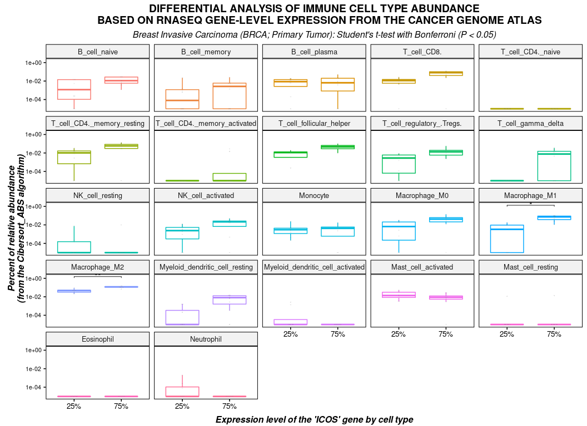

<!-- README.md is generated from README.Rmd. Please edit that file -->

# tcgaViz

<!-- badges: start -->

[](https://CRAN.R-project.org/package=tcgaViz)
<!-- badges: end -->

Differential analysis of tumor tissue immune cell type abundance based
on RNASeq gene-level expression from The Cancer Genome Atlas (TCGA)
database.

## Installation

Required: - Softwares : R (≥ 3.3.0); RStudio
(<https://posit.co/downloads/>) - R libraries : see the
[DESCRIPTION](https://github.com/ecamenen/tcgaViz/blob/develop/DESCRIPTION)
file.

You can install the development version from
[GitHub](https://github.com/) with:

``` r
# install.packages("devtools")
devtools::install_github("ecamenen/tcgaViz")
```

## Launch the Shiny server

1.  Download the tcga dataset
    [here](https://zenodo.org/record/6577211/files/tcga.rda?download=1).
2.  Copy it in the “extdata” folder of the library (get the path of your
    library with the following R command:
    `system.file("extdata", package = "tcgaViz")`.
3.  Open RStudio and run: `tcgaViz::run_app()`

## Docker

### Pull

    docker pull eucee/tcga-viz

### Run in command-line

    docker run --rm -p 127.0.0.1:3838:3838 eucee/tcga-viz

## Example

### Load the dataset

A subset of invasive breast carcinoma data from primary tumor tissue.
See `?tcga` for more information on loading the full dataset or
metadata.

``` r
library(tcgaViz)
library(ggplot2)
data(tcga)
head(tcga$genes)
#> # A tibble: 6 x 2
#>   sample           ICOS
#>   <chr>           <dbl>
#> 1 TCGA-3C-AAAU-01  1.25
#> 2 TCGA-A2-A04Q-01  7.79
#> 3 TCGA-A2-A0T4-01  4.97
#> 4 TCGA-A8-A08S-01  3.69
#> 5 TCGA-A8-A09B-01  2.55
#> 6 TCGA-A8-A0AD-01  3.72
head(tcga$cells$Cibersort_ABS)
#> # A tibble: 6 x 24
#>   sample          study B_cell_naive B_cell_memory B_cell_plasma T_cell_CD8.
#>   <chr>           <fct>        <dbl>         <dbl>         <dbl>       <dbl>
#> 1 TCGA-3C-AAAU-01 BRCA      0             0.0221         0.0192       0.0129
#> 2 TCGA-A2-A04Q-01 BRCA      0.0274        0.0249         0.0236       0.118 
#> 3 TCGA-A2-A0T4-01 BRCA      0.0167        0              0.0159       0.0432
#> 4 TCGA-A8-A08S-01 BRCA      0             0.00425        0            0.0217
#> 5 TCGA-A8-A09B-01 BRCA      0.0146        0              0.00612      0.0256
#> 6 TCGA-A8-A0AD-01 BRCA      0.000919      0.000797       0.00290      0     
#> # … with 18 more variables: T_cell_CD4._naive <dbl>,
#> #   T_cell_CD4._memory_resting <dbl>, T_cell_CD4._memory_activated <dbl>,
#> #   T_cell_follicular_helper <dbl>, T_cell_regulatory_.Tregs. <dbl>,
#> #   T_cell_gamma_delta <dbl>, NK_cell_resting <dbl>, NK_cell_activated <dbl>,
#> #   Monocyte <dbl>, Macrophage_M0 <dbl>, Macrophage_M1 <dbl>,
#> #   Macrophage_M2 <dbl>, Myeloid_dendritic_cell_resting <dbl>,
#> #   Myeloid_dendritic_cell_activated <dbl>, Mast_cell_activated <dbl>,
#> #   Mast_cell_resting <dbl>, Eosinophil <dbl>, Neutrophil <dbl>
```

### Violin plot of cell subtypes

And perform a significance of a Wilcoxon adjusted test according to the
expression level (high or low) of a selected gene.

``` r
(df <- convert2biodata(
  algorithm = "Cibersort_ABS",
  disease = "breast invasive carcinoma",
  tissue = "Primary Tumor",
  gene_x = "ICOS"
))
#> # A tibble: 660 x 3
#>    high  cell_type       value
#>  * <fct> <fct>           <dbl>
#>  1 Low   B_cell_naive 0.00001 
#>  2 High  B_cell_naive 0.0274  
#>  3 High  B_cell_naive 0.0167  
#>  4 Low   B_cell_naive 0.00001 
#>  5 Low   B_cell_naive 0.0146  
#>  6 Low   B_cell_naive 0.000929
#>  7 Low   B_cell_naive 0.00180 
#>  8 High  B_cell_naive 0.0112  
#>  9 Low   B_cell_naive 0.0141  
#> 10 Low   B_cell_naive 0.00546 
#> # … with 650 more rows
(stats <- calculate_pvalue(df))
#> Breast Invasive Carcinoma (BRCA; Primary Tumor)
#> Wilcoxon-Mann-Whitney test with Benjamini & Hochberg correction (n_low = 16; n_high = 14).
#> # A tibble: 6 x 9
#>   `Cell type`                `Average(High)` `Average(Low)` `SD(High)` `SD(Low)`
#>   <fct>                                <dbl>          <dbl>      <dbl>     <dbl>
#> 1 Macrophage_M1                      0.0454        0.00943      0.0328   0.0116 
#> 2 Macrophage_M2                      0.109         0.0697       0.0321   0.0368 
#> 3 T_cell_CD4._memory_resting         0.0504        0.0122       0.0377   0.0124 
#> 4 T_cell_CD8.                        0.0498        0.0127       0.0387   0.00934
#> 5 T_cell_follicular_helper           0.0352        0.0119       0.0259   0.00691
#> 6 T_cell_gamma_delta                 0.00823       0.000956     0.0101   0.00258
#> # … with 4 more variables: Average(High - Low) <dbl>, P-value <dbl>,
#> #   P-value adjusted <dbl>, Significance <chr>
plot(df, stats = stats)
```

<!-- -->

### Advanced parameters

With
[ggplot2::theme()](https://ggplot2.tidyverse.org/reference/theme.html)
expressions.

``` r
(df <- convert2biodata(
  algorithm = "Cibersort_ABS",
  disease = "breast invasive carcinoma",
  tissue = "Primary Tumor",
  gene_x = "ICOS",
  stat = "quantile"
))
#> # A tibble: 352 x 3
#>    high  cell_type      value
#>  * <fct> <fct>          <dbl>
#>  1 25%   B_cell_naive 0.00001
#>  2 75%   B_cell_naive 0.0274 
#>  3 25%   B_cell_naive 0.0146 
#>  4 75%   B_cell_naive 0.0112 
#>  5 25%   B_cell_naive 0.0141 
#>  6 25%   B_cell_naive 0.00546
#>  7 75%   B_cell_naive 0.0289 
#>  8 75%   B_cell_naive 0.00376
#>  9 25%   B_cell_naive 0.00001
#> 10 75%   B_cell_naive 0.00118
#> # … with 342 more rows
(stats <- calculate_pvalue(
    df,
    method_test = "t_test",
    method_adjust = "bonferroni",
    p_threshold = 0.05
))
#> Breast Invasive Carcinoma (BRCA; Primary Tumor)
#> Student's t-test with bonferroni correction (n_low = 8; n_high = 8).
#> # A tibble: 2 x 9
#>   `Cell type` `Average(75%)` `Average(25%)` `SD(75%)` `SD(25%)` `Average(75% - …
#>   <fct>                <dbl>          <dbl>     <dbl>     <dbl>            <dbl>
#> 1 Macrophage…         0.0646        0.00560    0.0348   0.00651           0.0590
#> 2 Macrophage…         0.117         0.0456     0.0274   0.0216            0.0719
#> # … with 3 more variables: P-value <dbl>, P-value adjusted <dbl>,
#> #   Significance <chr>
plot(
    df,
    stats = stats,
    type = "boxplot",
    dots = TRUE,
    xlab = "Expression level of the 'ICOS' gene by cell type",
    ylab = "Percent of relative abundance\n(from the Cibersort_ABS algorithm)",
    title = toupper("Differential analysis of immune cell type abundance
    based on RNASeq gene-level expression from The Cancer Genome Atlas"),
    axis.text.y = element_text(size = 8, hjust = 0.5),
    plot.title =  element_text(face = "bold", hjust = 0.5),
    plot.subtitle =  element_text(size = , face = "italic", hjust = 0.5),
    draw = FALSE
) + labs(
    subtitle = paste("Breast Invasive Carcinoma (BRCA; Primary Tumor):",
    "Student's t-test with Bonferroni (P < 0.05)")
)
```

<!-- -->
